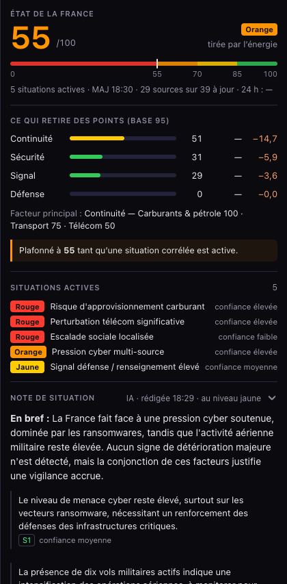

# Panneau v2 : kit de style « fmk »

Référence de style des panneaux de la v2, établie sur l'onglet « État de la France » (spec
`docs/superpowers/specs/2026-10-01-panneau-etat-reference-design.md`). Tout panneau restylé
reprend ces jetons, ces composants et ces règles.

## Jetons
| Rôle | Valeur |
|---|---|
| Fond de panneau | `--bg-primary` (#0a0a0f), fond de la colonne |
| Filet | `--border-color` (#2a2a3e) |
| Piste de barre | `--bg-surface-hover` (#22223a) |
| Texte principal / secondaire / discret | `--text-primary` / `--text-secondary` / `--text-muted` |
| Niveaux | `--sev-green`, `--sev-yellow`, `--sev-orange`, `--sev-red` (via `levelColorVar`) |
| Interactif | `--v2-brand` (#4bfc94) |
| Points retirés (perte, pas un niveau) | `--fmk-loss` (#ff9f6b) |

## Typographie
- Texte : police système. Chiffres : `font-variant-numeric: tabular-nums` (classe `fmk-num`) ; pas de police à chasse fixe.
- Sur-titres et titres de section : `fmk-eyebrow` (11 px, capitales, interlettrage 0,06 em).
- Chiffre héros : 46 px, graisse 650, couleur du niveau.

## Composants (`src/components/fiche/kit.ts`, `src/components/fiche/parts.ts`, `src/components/shared/vigilancePill.ts`)
| Composant | Rendu | Usage |
|---|---|---|
| En-tête Instrument | rendu par `renderFiche` à partir des données `FicheModel.score` (pas un composant de `kit.ts`) | score, échelle 0–55–70–85–100, fraîcheur, piliers, facteur, plafond |
| Section | `FicheSection` avec `id`, `summary`, `collapsible`, `open` | titre + résumé à droite + chevron ; mémoire par `data-section` |
| Ligne de mesure | `meterRow()` | libellé · barre · valeur · colonnes en plus ; une seule forme |
| Point de niveau | `levelDot()` | domaine, résumé |
| Comptes par niveau | `levelCounts()` | résumé d'une section à plusieurs niveaux |
| Clé · valeur | `kvRow()` | chiffre isolé (production, stocks, prix) |
| Encart | `fmk-callout` | une condition qui change la lecture (plafond) |
| Pastille de niveau | `renderVigilancePill()` | niveau d'une ligne ; largeur fixe |

## Fiches sans score (événement, situation, thème, alerte officielle, marché)
Spec `docs/superpowers/specs/2026-10-01-fiches-kit-design.md` (fiches construites avec `kit.ts`). Seul l'en-tête est en grand ; tout le reste est au même niveau.
- En-tête kit : sur-titre (`fmk-eyebrow`, type et thème), titre 19 px (`fmk-title`), ligne de niveau (pastille, contexte, séparateurs « • »), synthèse en une ou deux phrases (`fmk-lead`, 14,5 px).
- Section « Indicateurs » ouverte sous l'en-tête ; tous les titres de section ont la même taille (11 px, capitales).
- Ton « référence » (`fmk-sec--ref`, #6e6e80) pour les sections de consultation (articles, sources) : plus discrètes que les sections d'action.
- Courbe de corroboration en escalier, neutre (gris #c8c8d4), étiquettes d'axe hors du tracé ; aucune couleur de niveau.
- Barres d'indicateurs d'une situation à la couleur de leur propre intensité (85 % rouge, 70 % orange, 55 % jaune, sinon vert) ; la confiance reste en gris.
- « À faire » : liste numérotée (`fmk-todo`) avec, sous chaque action, les rôles en petit.
- Heures absolues, heure de Paris : `hh:mm` le jour même, `jj/mm hh:mm` sinon ; le relatif n'est jamais seul.
- Aucun tiret cadratin dans un texte affiché : séparateur « · » ou « : », valeur absente « n.d. », plage « à ».
- Retour d'action (« Référence copiée », « Copie impossible ») : `fiche-toast`, en haut à gauche de la fiche.

## Panneaux de couches
Cadre commun des panneaux flottants de couche (code : `src/components/layer-panel/frame.ts`, styles : bloc « Panneaux de couches : cadre commun » de `src/styles/main.css`). Panneaux migrés : Réseau électrique (`grid.ts`), Parc nucléaire (`nuclear.ts`), Réseau gaz (`gas.ts`), Stress hydro (`hydro.ts`), Pétrole (`oil.ts`), Éolien (`wind.ts`), Charge métropolitaine (`metro.ts`, panneau nouveau) et Énergie DROM (`drom.ts`). Outils communs : formateurs `layer-panel/format.ts`, courbe `layer-panel/chart.ts`, lignes `listRow` et `barRow` (`frame.ts`).

Structure, de haut en bas :
- En-tête collant (`lp-head`) : sur-titre « Thème · Couche », titre = libellé de la pastille de la couche, gros chiffre facultatif (`lp-figure`, avec sa légende), ligne de niveau (pastille de niveau puis contexte séparé par « · »), synthèse en une ou deux phrases, puis onglets s'il y en a. Le bouton de fermeture rond (28 px) reste visible en haut à droite pendant le défilement.
- Corps (`lp-body`) : sections du kit (`FicheSection`), séparées par des filets fins, chacune avec son résumé sur la ligne de titre ; l'essentiel est ouvert, le détail replié ; l'ouverture choisie par l'utilisateur et l'onglet actif survivent au rafraîchissement.
- Sources : section en ton « référence » (`fmk-sec--ref`), en dernier.

États :
- Chargement : loader unique (`fmLoaderHTML`) et « Chargement des données… ».
- Erreur de source : encart (`fmk-callout`) « Source injoignable » avec l'heure des dernières données, jamais « indisponible » pour une donnée qui charge.
- Vide : une phrase dite (`fiche-empty`), jamais un zéro.
- En retard : la ligne de niveau dit « données de hh:mm (en retard) » au-delà de deux périodes de rafraîchissement de la source ; l'heure est celle de la donnée, en absolu (heure de Paris).

Règles :
1. Pas de dégradé, pas de tuile d'icône, pas de glisser-déposer : le panneau est ancré (à droite en v1, dans la colonne en v2, en feuille basse sous 768 px).
2. Couleurs : un état ou un seuil prend la palette des niveaux (`levelColorVar`, `levelDot`, `renderVigilancePill`, gris « n.d. ») ; une catégorie prend un jeton `--mix-*` ou `--cat-*` défini dans `:root`. Jamais de couleur brute dans le HTML d'une vue, jamais de jauge grise : chaque barre prend une couleur de niveau ou de catégorie. Jetons de catégorie :

   | Jeton | Usage |
   |---|---|
   | `--mix-nuclear`, `--mix-hydro`, `--mix-wind`, `--mix-solar`, `--mix-thermal`, `--mix-bio` | filières de production (Réseau électrique, Parc nucléaire, Stress hydro, Éolien, DROM) |
   | `--mix-coal`, `--mix-oil`, `--mix-turbine`, `--mix-geo`, `--mix-storage`, `--mix-links`, `--mix-other` | filières des DROM et de la Corse |
   | `--cat-onshore`, `--cat-offshore` | éolien terrestre et en mer |
   | `--cat-gazole`, `--cat-sp95`, `--cat-sp98`, `--cat-e10`, `--cat-gpl` | carburants (graphe et légende des prix) |
   | `--cat-lng` | terminaux GNL (utilisation), part du GNL |
   | `--cat-crude` | origines du pétrole brut |
   | `--cat-renewable` | part renouvelable des territoires |
   | `--cat-substation`, `--cat-pylon`, `--cat-production` | types d'actifs DROM |
3. Chiffres en `fmk-num`, aucune police à chasse fixe, aucun tiret cadratin.
4. Tout texte et tout lien venant d'un tiers est échappé ; les liens passent par `safeHref`.
5. Fermer par la croix éteint la couche (rappel `onClose`, appelé une seule fois) ; le masquage silencieux (`hide({ silent: true })`) ne l'appelle jamais.

Règles du lot 2 (R1 à R4) et préférences de l'utilisateur :
- R1 : une valeur tient sur une ligne. Espace insécable entre le nombre et l'unité et avant « % », valeurs en `white-space: nowrap`, gros chiffre avec son unité et sa légende dessous ; c'est la légende qui passe à la ligne. Contrôle par `breakableValue` dans le test de chaque vue et à l'écran.
- R2 : graphes et indicateurs colorés repris au restylage, jamais neutralisés (voir la règle 2 et le tableau des jetons). Les jauges sont toujours en couleur.
- R3 : le gros chiffre prend la couleur de son propre niveau quand il en a un (Parc nucléaire, Réseau gaz, Éolien selon l'état du vent, Charge métropolitaine selon l'écart du total à la veille à ±5 %, Énergie DROM selon la part renouvelable : vert dès 50 %, jaune dès 25 %, orange en dessous) ; sinon il hérite du niveau de la pastille du panneau (c'est le cas de Stress hydro : pas de niveau propre, mais pas de couleur non plus quand l'éCO2mix a plus de 45 min). Un `level: null` explicite (donnée en retard : éCO2mix au-delà de 45 min, lecture RTE au-delà de 30 min, gaz sur valeurs de référence), une valeur « n.d. » ou une pastille « n.d. » le laisse en couleur de texte. Une part placée dans la légende du chiffre (facteur de charge éolien, part du parc hydraulique) prend la couleur du chiffre.
- R4 : aucun tiret cadratin.
- Toute mesure principale qui est une quantité est le gros chiffre, avec son unité (« 46,4 GW », « 93,4 % », « 1,689 € », « 336 MW »).
- Échanges (Réseau électrique) : import en rouge, export en vert, avec une flèche ▲ ou ▼ de tendance par rapport à l'historique sur 7 jours.
- Donnée en retard : la ligne de niveau dit « (en retard) » et les couleurs de niveau disparaissent.
- Rien ne disparaît à la migration : chaque indicateur, graphe ou note de l'ancien panneau est conservé, ou déplacé dans « Méthode et sources ».
- Une phrase qui décrit une fraîcheur (et non une valeur) passe à la ligne dans les détails repliés : libellé de largeur fixe, jamais recouvert.

## Correspondance avec la spec
- `fmk-chip` : pastille `fm-vig` (`renderVigilancePill`)
- `fmk-ref` : `fiche-ref`
- `fmk-btn` : `fiche-action`
- `fmk-sec`, `fmk-score`, `fmk-meter` : mêmes noms

## Règles
1. Aucun cadre dans un cadre : séparer par des filets.
2. Les couleurs de niveau disent un niveau, rien d'autre ; le vert de marque désigne ce qui est cliquable.
3. Chaque section repliée dit l'essentiel sur sa ligne de titre (« 96/100 · 2 à surveiller »).
4. L'essentiel tient dans la première hauteur d'écran ; le détail se déplie.
5. Jamais « indisponible » pour une donnée qui charge : « en attente », « chargement… », « en préparation ».
6. Même rendu en colonne de 420 px et en pleine largeur.
7. Une valeur dans une colonne de largeur fixe reste courte ; tout qualificatif va sur la ligne de note sous la ligne.

## Restyler un autre panneau
1. Construire son modèle en `FicheModel` (ou ses blocs avec `kit.ts`).
2. Donner un `id` et un résumé à chaque section ; choisir ce qui est ouvert par défaut.
3. Remplacer cadres et polices à chasse fixe par filets, `fmk-num` et `meterRow`.
4. Vérifier à 1600, 1280 et 390 px.
